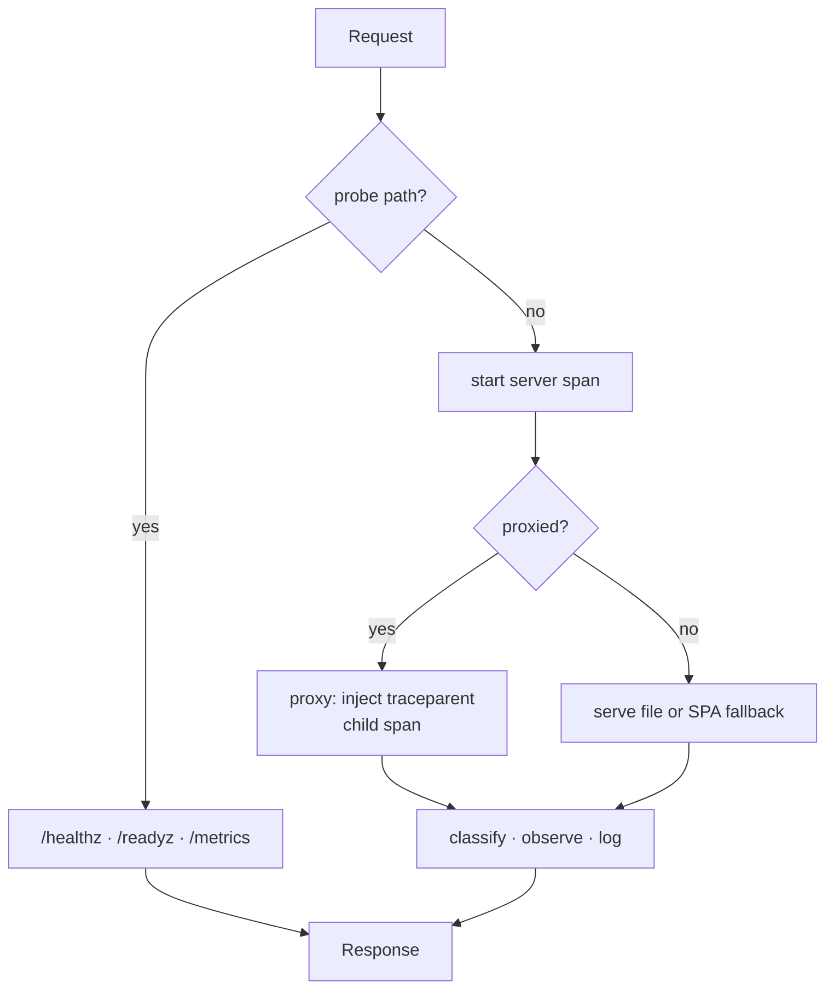

<!-- markdownlint-disable-file MD025 MD041 -->

# DESIGN-0006: Server observability — structured logging, split probes, Prometheus metrics, and OTel tracing

<!--toc:start-->
- [Overview](#overview)
- [Goals and Non-Goals](#goals-and-non-goals)
  - [Goals](#goals)
  - [Non-Goals](#non-goals)
- [Background](#background)
- [Detailed Design](#detailed-design)
  - [Component 1 — Route classification](#component-1--route-classification)
  - [Component 2 — Redaction](#component-2--redaction)
  - [Component 3 — Structured logging](#component-3--structured-logging)
  - [Component 4 — Split probes](#component-4--split-probes)
  - [Component 5 — Prometheus metrics](#component-5--prometheus-metrics)
  - [Component 6 — OpenTelemetry tracing](#component-6--opentelemetry-tracing)
  - [Component 7 — Packaging the dependencies](#component-7--packaging-the-dependencies)
  - [Component 8 — The request pipeline](#component-8--the-request-pipeline)
- [API / Interface Changes](#api--interface-changes)
- [Data Model](#data-model)
- [Testing Strategy](#testing-strategy)
- [Migration / Rollout Plan](#migration--rollout-plan)
- [Open Questions](#open-questions)
- [References](#references)
<!--toc:end-->

## Overview

Give `server/serve.ts` an observability surface: structured stdout
logging with a debug mode aimed at OAuth/IdP troubleshooting, a real
readiness probe separated from liveness, Prometheus metrics, and
OpenTelemetry tracing that stitches to docz-api's existing traces.

Per [INV-0006](../investigation/0006-server-observability-logging-health-probes-metrics-and-the-otel.md)
this is the **split**, not all-OTel: Prometheus for metrics, OTel for
traces, plain structured stdout for logs — matching docz-api. It ships
as **two PRs under this one design**: logs and probes first (no new
dependencies), then metrics and traces. See
[Migration / Rollout Plan](#migration--rollout-plan).

Every signal degrades to nothing when unconfigured. A deployment with no
Prometheus and no collector sets nothing and pays nothing.

## Goals and Non-Goals

### Goals

- An operator can debug an Okta/Keycloak login end to end from the site
  container's logs alone — the gap that motivated issue #18.
- A failed upstream names its cause instead of discarding it.
- A bad deploy (missing/mis-mounted `dist/`) is caught by the rollout
  rather than by users.
- Metric and trace labels are bounded by construction, so no request can
  inflate cardinality.
- Credential-bearing values (`code`, `state`, cookies) cannot reach logs
  or spans at any level — enforced by a test, not by care.
- Zero configuration required: absent env, behaviour matches today plus
  the proxy-failure logging.

### Non-Goals

- **Browser/RUM telemetry.** Measured at 23.4 KB gz against 7.5 KB of
  headroom (INV-0006 F11). Scope questions are raised in OQ-6/OQ-7, not
  assumed in.
- **Alerting rules.** docz-api ships a `PrometheusRule`; we are not
  copying it until there is traffic data to write thresholds from.
- **Log shipping.** Structured stdout is the contract; forwarders are
  the deployment's business.
- **Replacing docz-api's telemetry.** We instrument our own hop only.
- **Tracing the SPA.** The root span starts at our server.

## Background

[INV-0006](../investigation/0006-server-observability-logging-health-probes-metrics-and-the-otel.md)
is Concluded; its findings are the premises here. The load-bearing ones:

- **F1** — the proxy `catch` binds nothing, so upstream failure causes
  are destroyed at the language level.
- **F2/F3** — `/healthz` is unconditional and both chart probes point at
  it. A readiness probe gated on docz-api would convert a degradation
  DESIGN-0003 deliberately handles into a total outage; readiness must
  check **serving** dependencies only.
- **F5** — docz-api runs Prometheus + OTel + slog, and already extracts
  W3C `traceparent`, so end-to-end tracing costs only our half.
- **F7** — auto-instrumentation would ship OAuth codes to a collector;
  instrumentation must be hand-written with an allowlist.
- **F8** — SPA paths are unbounded and attacker-controllable; labels must
  be route *classes*.
- **F10** — OTel context propagation verified working under Bun 1.3.14.
- **F11** — `prom-client` verified working under Bun; browser OTel does
  not fit the bundle budget.

One constraint discovered while drafting this document and **not** in
INV-0006: the runtime image contains no `node_modules` at all. See
[Component 7](#component-7--packaging-the-dependencies).

## Detailed Design

Eight components. 1 and 2 are shared primitives every signal depends on,
so they come first.

### Component 1 — Route classification

`server/route-class.ts`. One classifier, used by logs, metrics, **and**
traces, so the three always agree and none can independently blow up
cardinality.

```ts
export type RouteClass =
  | "asset"          // /assets/* — content-hashed, immutable
  | "static"         // other real file under dist/
  | "spa"            // index.html fallback
  | "proxy:api"
  | "proxy:auth"
  | "proxy:webhooks"
  | "proxy:openapi"
  | "probe";         // /healthz, /readyz, /metrics
```

Eight values, closed. They map exactly onto the branches
`handleRequest` already takes, so classification is a read of a decision
already made rather than a second parse of the URL.

`static` vs `spa` is only knowable after the file lookup, so the class
is finalised at response time, not on entry.

**Method is also unbounded** and this is easy to miss: `fetch()` accepts
arbitrary method tokens, so `method` is attacker-controlled just as
`path` is. It is normalised against a closed set
(`GET HEAD POST PUT PATCH DELETE OPTIONS`), everything else collapsing
to `other`.

### Component 2 — Redaction

`server/redact.ts`. Issue #18 calls redaction non-negotiable; this is
the module that makes it structural rather than a habit.

**Rule 1 — headers are never logged or attached to spans.** No
allowlist, no exceptions. `proxy()` copies every inbound header
including the session cookie (`serve.ts:206`) and returns every upstream
header including `set-cookie` (line 221). The only header fact we record
is *presence*: `has_cookie: true`.

**Rule 2 — query values are never recorded; query *keys* are.** Knowing
`state` was absent from a callback is exactly the OAuth bug an operator
is hunting; knowing its value is a credential leak. So:

```text
/auth/callback?code=<redacted>&state=<redacted>
```

Keys pass through, every value becomes `<redacted>`, unless the key is
on a short safe allowlist (currently empty — added only with a reason).

This is an **allowlist, not a denylist**. A denylist of
`code`/`state` fails open the first time a provider introduces a new
credential-bearing parameter, and we would not notice.

**Rule 3 — redirect `Location` is reduced to its host.** The OAuth 302
carries the full authorize URL with client id and state. The host is
what an operator needs (`did we send them to the right IdP?`); the rest
is not ours to log.

### Component 3 — Structured logging

`server/logger.ts`, hand-written, no dependency. JSON to stdout, one
object per line, plus a `text` mode for local work.

It is hand-written rather than pino because it is roughly 80 lines, it
keeps the server's dependency count at zero for the logging path, and
the redaction rules above want to be applied at the call site by
construction rather than bolted onto a general-purpose serialiser.

Levels `debug < info < warn < error`, default `info`. Resolved by the
same whitelist discipline as the existing `resolve*` helpers — unknown
values fall back to the default rather than throwing.

| Event | Level | Fields |
| --- | --- | --- |
| `server.start` | info | port, dist, auth_providers, proxy_target, log_level, metrics_enabled, otel_enabled |
| `http.request` | debug | method, route, path (redacted), status, duration_ms |
| `proxy.request` | debug | method, route, target_host, upstream_status, duration_ms, location_host |
| `proxy.error` | **error** | method, route, target_host, err_name, err_message, duration_ms |
| `config.invalid` | warn | key, reason (not the value) |
| `readyz.fail` | warn | check, reason |

This satisfies issue #18's requested shape exactly: at the **default**
level you get the startup line plus proxy failures *with their cause*;
at **debug** you get request lines and the `/auth/*` flow. Probe paths
are excluded at every level (INV-0006 F5) — a kubelet probing every 10 s
would otherwise be most of the log volume on a quiet docs site.

`proxy.error` is the F1 fix and the highest-value line in the table:

```ts
} catch (err) {
  log.error("proxy.error", {
    method: req.method, route, target_host: target.host,
    err_name: err instanceof Error ? err.name : "unknown",
    err_message: err instanceof Error ? err.message : String(err),
    duration_ms: Math.round(performance.now() - started),
  });
  metrics.proxyErrors.labels("unreachable").inc();
  return new Response("upstream unreachable", { status: 502 });
}
```

`502 DOCZ_API_URL is not configured` gets its own `reason`
(`not_configured`) so a config fault is distinguishable from a network
fault — from the outside they are identical today.

### Component 4 — Split probes

**`/healthz` is unchanged.** Unconditional `200 ok`, liveness only. The
Dockerfile `HEALTHCHECK` keeps pointing at it.

**`/readyz` is new** and checks serving dependencies only:

| Check | Method | Failure meaning |
| --- | --- | --- |
| `dist` | `Bun.file(dist/index.html).exists()` | image or mount is broken; serving cannot work |
| `config` | resolvers ran without falling back on a malformed value | deployment config is wrong |

```json
{ "status": "ready", "checks": { "dist": "ok", "config": "ok" } }
```

503 with the offender named if any check fails.

The liveness/readiness distinction is the whole point and worth stating
because it is what makes a second endpoint worth having: **a failing
liveness probe restarts the container; a failing readiness probe holds
traffic.** A missing `dist/` is not fixed by restarting — that is
CrashLoopBackOff — but it absolutely should stop the rollout and keep
the previous ReplicaSet serving. Same detection, correct response.

**`/readyz` does not contact docz-api.** This is the INV-0006 F3
conclusion, and it is stronger than the INV's own draft wording: that
floated reporting upstream reachability in the body as informational,
and on reflection that is worse than not doing it. It would mean a live
network call on every probe — every 10 s per pod, forever — to populate
a field nothing gates on, adding load and a failure mode for no
decision. API health is a **metric** (`docz_site_proxy_errors_total`),
which is the surface that can alert a human without evicting a pod.
Raised as OQ-3 since it is a change from the INV.

These three paths (`/healthz`, `/readyz`, `/metrics`) become **reserved
server paths**, the same way `/pages/*` and `changelog` are reserved in
the router. No SPA route can claim them. None collide today — app routes
are `/`, `/login`, `/repos`, and `/:owner/:repo/*`.

### Component 5 — Prometheus metrics

`prom-client` on `/metrics`, gated by `DOCZ_METRICS_ENABLED`
(default `true`, matching docz-api's `METRICS_ENABLED`).

| Metric | Type | Labels |
| --- | --- | --- |
| `docz_site_http_requests_total` | counter | method, route, status |
| `docz_site_http_request_duration_seconds` | histogram | method, route |
| `docz_site_proxy_duration_seconds` | histogram | route |
| `docz_site_proxy_errors_total` | counter | reason (`unreachable`, `not_configured`) |
| `collectDefaultMetrics()` | — | process/runtime, free |

Max series ≈ 8 methods × 8 routes × ~10 statuses — a few hundred,
bounded by construction.

`docz_site_proxy_errors_total` is the one that matters most: it is the
docz-api-health signal that replaces the readiness check we are
deliberately not doing, and the metric an alert should hang off.

INV-0006 F11 gap to know about: `nodejs_gc_duration_seconds` registers
but never samples under Bun, as do the non-`_total`
`nodejs_active_*` variants. A dashboard copied from a Node service will
show empty panels. Not an error; worth a line in the chart README.

### Component 6 — OpenTelemetry tracing

Hand-instrumented, **no auto-instrumentation** (INV-0006 F7 — the OTel
HTTP instrumentation records `url.full` by default, which on this proxy
means shipping OAuth authorization codes to a collector).

Two spans per request:

- `{METHOD} {routeClass}` — server span, root
- `proxy.upstream` — child, wrapping the `fetch` to docz-api

Attributes are an allowlist: `http.request.method`, `http.route` (the
class), `http.response.status_code`, `url.path` (redacted).
**Never** `url.full`, never headers. 5xx sets span status `ERROR`; 4xx
does not (client fault, matching docz-api's `serverErrorFloor`).

`traceparent` is injected on the proxy hop. docz-api already installs a
`TraceContext` propagator unconditionally and calls `Extract` on every
request, so its spans become children of ours with **zero upstream
change** — end-to-end traces across the proxy for the cost of our half
alone (INV-0006 F5, F10).

Unconfigured `OTEL_EXPORTER_OTLP_ENDPOINT` means the global tracer stays
the OTel no-op: spans are created, never exported, nothing is sent.
This mirrors docz-api's degrades-to-nothing property, which matters for
single-operator installs.



Probe paths short-circuit before any signal is recorded — they are
never logged, metered, or traced.

### Component 7 — Packaging the dependencies

**This is the constraint that most shapes the work, and it was not in
INV-0006.** The runtime image contains only `dist/` and
`server/serve.ts` — no `node_modules`, stated at `Dockerfile:3` and
enforced by the copies at lines 27–28. The server today imports nothing.
`prom-client` and the OTel SDK would be the first runtime dependencies
it has ever had, and there is currently nowhere for them to live.

Measured options:

| Approach | Size added to image |
| --- | --- |
| **Bundle the server** (`bun build --target=bun`) | **420 KB, one file** |
| Copy `node_modules` | tens of MB (64 MB in the spike tree) |
| Hand-roll both | 0, but see OQ-2 |

Recommended: bundle. The build stage gains

```dockerfile
RUN bun build server/serve.ts --target=bun --outfile=dist-server/serve.js
```

and the runtime stage copies `dist-server/serve.js` instead of the
source. `import.meta.main` still holds for a bundle entrypoint, so the
startup guard is unaffected, and `server/serve.test.ts` keeps importing
the **source**, so tests are untouched.

For reference, the marginal cost is dominated by OTel: `prom-client`
alone bundles to 146 KB, the OTel tracer plus OTLP/HTTP exporter to
382 KB, both together 420 KB. That asymmetry is what OQ-2 is about.

### Component 8 — The request pipeline

`handleRequest` gains a thin wrapper rather than scattering
instrumentation through the branches:

1. **Probe paths first** — `/healthz`, `/readyz`, `/metrics` return
   immediately, before any span, metric, or log line.
2. **Everything else** — start the timer and server span, run today's
   logic unchanged, then classify the outcome and emit all three signals
   from one place.

One emission point means the log line, the metric, and the span can
never disagree about what happened, which is a property worth more than
the handful of lines it costs.

## API / Interface Changes

**New HTTP endpoints** (server-only; not app routes, not proxied):

| Path | Response |
| --- | --- |
| `GET /readyz` | 200/503 JSON, checks named |
| `GET /metrics` | 200 Prometheus text, or 404 when disabled |

**New environment variables.** Ours take the `DOCZ_` prefix like every
other site env; `OTEL_*` stay unprefixed because the SDKs read those
names natively (INV-0006 OQ-6).

| Env | Default | Values |
| --- | --- | --- |
| `DOCZ_LOG_LEVEL` | `info` | debug, info, warn, error |
| `DOCZ_LOG_FORMAT` | `json` | json, text |
| `DOCZ_METRICS_ENABLED` | `true` | true, false |
| `OTEL_EXPORTER_OTLP_ENDPOINT` | `""` | URL; empty = tracing off |
| `OTEL_SERVICE_NAME` | `docz-site` | string |
| `OTEL_SAMPLE_RATE` | `1.0` | 0.0–1.0, clamped |

All are validated by whitelist and fall back to the default on garbage,
consistent with `resolveAuthProviders` / `resolveNavLinks` /
`resolveMermaidLayout`.

**These do not enter `window.__DOCZ_CONFIG__`.** That object is SPA
configuration; these are server-only. Nothing here reaches the injected
`<script>`, so this change adds no HTML-injection surface.

**Chart changes** (`charts/docz-site`):

- `config.logLevel`, `config.logFormat`, `config.metricsEnabled`
- `otel.endpoint`, `otel.serviceName`, `otel.sampleRate`
- `serviceMonitor.enabled` (default `false`), `.interval`, `.labels`
- new `templates/servicemonitor.yaml`, mirroring docz-api's
- **`readinessProbe.httpGet.path` → `/readyz`**; liveness stays
  `/healthz`
- `values.schema.json` enums for the closed sets
- chart version bump, appVersion to the release

## Data Model

No persistence. Nothing is stored; every signal is emitted and
forgotten. No database, no file writes, no client-readable state — so
the "no tokens in JS-readable storage" rule is untouched, and nothing
here can be read by the SPA.

## Testing Strategy

`server/` is Bun-only and outside the vitest graph, so these run under
`bun test server/` (`just test-server`, already in the CI chain).

**Redaction is the security gate and is tested like one.** In the spirit
of the XSS suite: drive a realistic OAuth callback through the logger at
**every** level and assert the `code` and `state` *values* never appear
in the output, while the keys do. Parameterised over levels so a future
`trace` level cannot quietly bypass it, and asserting on captured stdout
rather than on the logger's inputs.

| Area | Cases |
| --- | --- |
| Redaction | values absent at every level; keys present; header values never emitted; Location reduced to host; unknown params redacted by default (allowlist, not denylist) |
| Route class | each of the 8; unknown method → `other`; hostile paths stay in-class |
| Logger | level filtering; json and text shape; unknown level → default |
| `/readyz` | 200 when dist present; 503 naming `dist` when absent; never contacts docz-api |
| `/healthz` | still unconditional |
| Metrics | exposition parses; labels bounded; disabled → 404; probe paths absent |
| Proxy errors | `unreachable` vs `not_configured` distinguished; cause logged |
| Config resolvers | garbage → default, per the existing pattern |
| Helm | new env rendered; ServiceMonitor gated on both flags; readiness path is `/readyz` |

A cardinality regression test is worth having: drive N distinct hostile
paths and methods through the classifier and assert the metric registry
series count stays bounded.

No e2e changes. These surfaces are server-side and invisible to
Playwright's journeys.

## Migration / Rollout Plan

**Two PRs, one design document, two minor versions.** The split is not
arbitrary — it falls exactly on the dependency boundary, which is what
makes it clean:

| | PR 1 — logs and probes | PR 2 — metrics and traces |
| --- | --- | --- |
| Components | 1, 2, 3, 4, and the pipeline wrapper of 8 | 5, 6, 7, and 8's signal emission |
| New runtime dependencies | **none** | `prom-client`, OTel SDK |
| Dockerfile change | **none** | bundling step (Component 7) |
| Chart change | log level/format values; readiness → `/readyz` | metrics + otel values, ServiceMonitor |
| Closes | issue #18 | — |
| Label | `minor` | `minor` |

PR 1 keeps the server's dependency count at **zero** and its packaging
untouched, because the logger is hand-written and the probes are
`Bun.file` calls. That means the whole Component 7 question — no
`node_modules` in the runtime image, bundling, a 420 KB artifact — is
deferred to PR 2 along with the dependencies that cause it. PR 1 is
therefore reviewable as a pure behaviour change with no build-system
risk, which is worth a lot given it touches the OAuth path.

Components 1 and 2 (route classification, redaction) land in PR 1
because logging needs them, and PR 2 reuses them unchanged. Building
them for logs first and metrics second is the right order anyway: the
label set gets exercised by log output before anything depends on its
cardinality properties.

**Ordering is required, not merely preferred.** PR 1 must ship first:
PR 2's metrics and spans consume PR 1's classifier and redaction module.

Backwards compatible by construction in both. Every new env defaults to
today's behaviour, so a deployment that upgrades and changes nothing
gets strictly more signal and no new configuration.

The one behavioural change is PR 1's chart pointing readiness at
`/readyz`. Sequencing matters — the chart must not ship a probe the
running image does not serve — but since chart and image release
together from this repo, and `appVersion` moves with it, a defaults-only
install is consistent. Worth an explicit note in the chart README for
anyone pinning `image.tag` independently of chart version.

Rollback is a chart revision; nothing here writes state.

## Open Questions

Each is lettered: **a** is my recommendation, **b**+ are real
alternatives, **other** is free-form. Decided questions keep their
reasoning rather than being deleted, so the design records why, not just
what.

**Decided 2026-09-18:** OQ-2 — take the OTel SDK.
Also decided outside the list: the work ships as **two PRs** (logs and
probes, then metrics and traces) under this single design.

---

**OQ-1 — Does `/metrics` belong on the public port?**
docz-api exposes `/metrics` on its main HTTP port and we would mirror
that. But docz-api is typically internal, whereas docz-site is the
internet-facing surface. Request counts by route class are low
sensitivity, but they do leak traffic shape.

- **a (recommended)** — Main port, `DOCZ_METRICS_ENABLED` default
  `true`, ServiceMonitor default `false`. Mirrors docz-api; deployments
  that care restrict at the ingress, which is where path policy already
  lives.
- **b** — Main port but default the endpoint **off**; opt in.
- **c** — A second listener on a separate port, so metrics can be bound
  to the cluster network and never routed publicly. Cleanest
  security story, most moving parts.
- **other** — _______

---

**OQ-2 — Do we take the OTel dependency at all? — DECIDED: (a) take the
SDK.**
Tracing is the expensive half: 382 KB of the 420 KB bundle, and the only
part needing an SDK. The cheaper alternative considered was generating a
W3C `traceparent` ourselves (~20 lines) and logging the trace id —
docz-api would still parent its spans to it, so its traces and our logs
would correlate, with no SDK, no exporter, no batching. What that loses
is our **own** spans: the proxy hop's latency, and any span for
non-proxied requests.

Decided in favour of the full SDK: context propagation is verified
working under Bun (F10), 420 KB is immaterial next to the Bun runtime
image, and our span is what makes a trace genuinely end-to-end rather
than starting at docz-api. Component 6 stands as written; the bundling
step in Component 7 is therefore required, in PR 2.

---

**OQ-3 — Should `/readyz` report upstream reachability informationally?**
INV-0006 floated reporting docz-api health in the readyz body while
never letting it set the status code. Drafting Component 4 changed my
mind and I would rather flag that than quietly drop it.

- **a (recommended)** — No upstream check in `/readyz` at all. A live
  call every 10 s per pod, forever, to populate a field nothing gates on
  is cost without a decision. `docz_site_proxy_errors_total` is the
  better surface.
- **b** — Include it, cached with a short TTL so probe frequency does
  not drive upstream load.
- **c** — Include it uncached, exactly as the INV floated.
- **other** — _______

---

**OQ-4 — Log format default.**
docz-api defaults to `text` and its chart sets `json`.

- **a (recommended)** — Default `json`, chart leaves it alone.
  Container logs are almost always machine-read; `text` stays available
  for local runs.
- **b** — Mirror docz-api exactly: default `text`, chart sets `json`.
  Consistency across services, at the cost of a raw `docker run` being
  the odd one out.
- **other** — _______

---

**OQ-5 — Request logs at debug only, or an info-level sampled line?**
Issue #18 proposes request lines at debug. On a quiet docs site, logging
every request at info would be affordable and would mean not having to
reproduce a problem at a raised level.

- **a (recommended)** — Debug only, as the issue proposes, no sampling.
  Keeps default output signal-dense; the failure cases that matter
  (`proxy.error`) are already at error level.
- **b** — Info level, unsampled. More default signal, noisier logs.
- **c** — Info level, sampled (e.g. 1-in-N) with errors always logged.
  Most machinery; least suited to this traffic volume.
- **other** — _______

---

**OQ-6 — Is the browser in scope, and does gating it solve the budget?**

First, the part that is not a question: **server tracing and browser
tracing are independent.** The OTel SDK from Component 6 runs inside the
Bun process and is bundled into the server artifact. It costs the
browser exactly zero bytes. Server tracing can ship in PR 2 and the
browser can stay dark indefinitely, with no coupling in either
direction.

Second, the part that is: **a config gate alone does not solve the
headroom problem.** A runtime flag around a *static* import ships all
23.4 KB to every visitor whether the flag is on or off, because the
bytes are in the module graph regardless. Only a **dynamic `import()`**
moves them off the eager path — the budget measures the entry chunk plus
its modulepreload closure, and a dynamically imported chunk is in
neither. We already rely on this: mermaid is ~700 KB in its own chunk
and does not count against the 122.5 KB.

So gate **and** lazy-load, or neither. Gating a static import is the one
combination that buys nothing.

Third, the tradeoff that survives even when the budget is satisfied.
Browser OTel must patch `fetch` before the app issues requests, and an
error boundary earns its keep during initial render. A telemetry chunk
that arrives after first paint misses early requests and early errors —
the highest-value events. Lazy browser telemetry is therefore
budget-safe but functionally weaker, which is a product decision, not a
build detail.

- **a (recommended)** — Server only for now. Land PR 1 and PR 2, then
  decide the browser on its own evidence. Nothing here forecloses it.
- **b** — Browser OTel in a third PR: dynamic `import()` gated on a
  runtime config flag, accepting that early events are missed.
- **c** — A small eager reporter instead: `window.onerror` +
  `unhandledrejection` + the error boundary, posting to a collector
  endpoint via `sendBeacon`. Catches events from the very first line,
  and plausibly a few hundred bytes rather than 23.4 KB — but it is not
  OTel and would not produce spans. **Estimate not yet measured.**
- **d** — Browser OTel eagerly, raising the bundle budget deliberately
  from 130 KB to ~150 KB. Honest about the cost, but spends the entire
  headroom reserve on telemetry.
- **other** — _______

---

**OQ-7 — Does the React error boundary land here?**
INV-0006 F9: there is no `errorElement`, no error boundary, and no
`window.onerror` anywhere, so a render throw is a blank page that
nothing records. It is a prerequisite for any browser telemetry, but it
is also user-facing on its own.

- **a (recommended)** — Separate issue and PR. It is a UI change with UI
  review concerns (what the fallback looks like, a11y of the error
  state) and shares no code with this work.
- **b** — Include it here, since it is the natural companion to
  server-side error visibility.
- **other** — _______

---

**OQ-8 — Chart: also ship a `PrometheusRule` with starter alerts?**
docz-api ships one, default off.

- **a (recommended)** — Not in either PR. Thresholds written without
  traffic data are guesses that get copied into production and then
  ignored. Revisit once the metrics have run somewhere real.
- **b** — Ship one now, default off, with a single conservative alert on
  `docz_site_proxy_errors_total` — the one threshold that does not need
  baseline data, since any sustained rate is bad.
- **other** — _______

## References

- [INV-0006 — Server observability](../investigation/0006-server-observability-logging-health-probes-metrics-and-the-otel.md) — the premises
- [Issue #18 — Server has no logging](https://github.com/donaldgifford/docz-site/issues/18)
- [DESIGN-0003 — no-auth mode and the session-unavailable 503](0003-support-docz-apis-no-auth-mode-and-the-session-unavailable-503.md) — why readiness must not gate on docz-api
- `server/serve.ts` — the subject
- `Dockerfile:3,27-28` — the no-`node_modules` constraint (Component 7)
- docz-api `internal/telemetry/` — the reference implementation
- docz-api `charts/docz-api/templates/servicemonitor.yaml` — scrape precedent
- [W3C Trace Context](https://www.w3.org/TR/trace-context/)
- [prom-client](https://github.com/siimon/prom-client)
