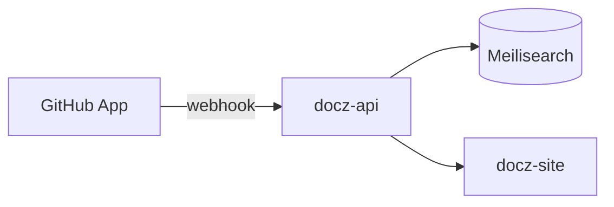
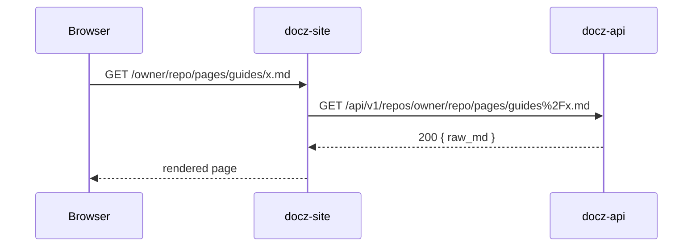

# Markdown rendering specimen

Every construct the reader pipeline renders, on one page, so a
typography or pipeline change can be judged in a single scroll instead
of hunting through real documents. The page is real repo content: the
MSW fixtures import this file (`bun run dev:msw`, then open
`/donaldgifford/docz-site/pages/guides/markdown-specimen.md`), and the
deployed site publishes it through the `api:` block in `.docz.yaml` at
the same path once docz-api syncs the repo. The accessibility sweeps
(`src/a11y/axe.test.tsx` and `e2e/a11y.spec.ts`) render it too, so a
construct that regresses contrast or structure fails CI.

When a pipeline feature lands, add a section here in the same commit.

## Headings

Sections use `h2`. The three levels below get copy-link buttons and
appear in the "on this page" rail; `h5` and `h6` render but do not.

### Level three

#### Level four

##### Level five

###### Level six

### Component 1: a heading with punctuation

### A heading with `inline code` and a [link](#headings)

#### Notes

The next heading has the same text, so its slug gains a suffix.

#### Notes

## Inline text

Plain, _emphasis_, **strong**, **_both_**, ~~strikethrough~~,
`inline code`, **`strong code`**, _`emphasized code`_, a
[plain link](https://github.com/donaldgifford/docz-site), and a
[linked `code` span](../design/0001-docz-site-cross-repo-docz-reader-and-search-ui.md)
that takes the accent because it goes somewhere. Keyboard keys use
<kbd>⌘</kbd> <kbd>K</kbd>; chemistry and math use H<sub>2</sub>O and
x<sup>2</sup>. Entities: &copy; &mdash; &lt;div&gt; &amp;. Unicode:
✅ 🚀 — “curly quotes” and an en–dash. A footnote reference[^1] and a
second one[^note].

A hard line break follows this line.\
This line starts after the break. Backslash escapes keep \*asterisks\*,
\_underscores\_, and \`backticks\` literal.

An unbroken token has to wrap without widening the column:
`docs/guides/a/very/long/path/that/keeps/going/without/any/spaces/so/overflow/wrap/has/to/do/its/job/in/prose.md`
and the same thing outside code:
docs/guides/a/very/long/path/that/keeps/going/without/any/spaces/so/overflow/wrap/has/to/do/its/job/in/prose.md

Dense chip run, the shape of a decisions list: `fetcher.ts` throws
`SessionRequiredError` on 401, `NotFoundError` on 404, and
`SessionUnavailableError` on 503; the `ApiError` rest is matched by
`status`, and `arr()` normalizes every wire array before iteration.

## Links and cross-references

- Doc-id tokens linkify when the repo's doc index resolves them:
  DESIGN-0001 and IMPL-0001.
- DESIGN-0004 exists in the repository but not in the demo fixtures, so
  it linkifies in production and stays text locally. RFC-9999 stays
  text everywhere.
- Tokens inside code stay text: `DESIGN-0001`.
- Relative link to a doc, resolved against this page's own repo path:
  [the site design](../design/0001-docz-site-cross-repo-docz-reader-and-search-ui.md),
  and with a fragment kept:
  [its open questions](../design/0001-docz-site-cross-repo-docz-reader-and-search-ui.md#open-questions).
- Relative links to published pages: [the root README](../../README.md)
  via `additional_docs`, [the exploratory input doc](../input.md) as a
  file page, and [the design index](../design/README.md) as a
  directory page.
- A relative link to something not published stays byte-identical, so
  it is a broken href by design: [package.json](../../package.json).
- A root-absolute app path is left alone: [the directory](/?type=design).
- An in-page anchor: [back to headings](#headings).
- A bare autolink: <https://github.com/donaldgifford/docz-api>.

## Lists

- Unordered, level one
  - Level two
    - Level three, with `code` and **strong**
  - Back to level two
- A second top-level item

1. Ordered, level one
2. With a nested unordered list
   - Nested bullet
   - Another nested bullet
3. A loose item with two paragraphs.

   The second paragraph of item three, followed by a code block that
   belongs to the item:

   ```bash
   bun run dev:msw
   ```

4. The last item

Ordered lists may start anywhere:

7. Seven
8. Eight

Task lists come from IMPL documents:

- [x] Done
- [ ] Open
- [x] Done, with a nested list
  - [ ] Nested open
  - [x] Nested done

## Blockquotes

> A single-paragraph quote.

> A multi-paragraph quote with **strong** text and `code`.
>
> The second paragraph.
>
> > A nested quote.
>
> - A list inside a quote
> - Second item

## Admonitions

> [!NOTE]
> Highlights information that users should take into account, even when
> skimming.

> [!TIP]
> Optional information to help a user be more successful.

> [!IMPORTANT]
> Crucial information necessary for users to succeed.

> [!WARNING]
> Critical content demanding immediate user attention due to potential
> risks.

> [!CAUTION]
> Negative potential consequences of an action. This one carries a list
> and a code block:
>
> - `arr()` before every iteration
> - never `fetch` the API directly
>
> ```ts
> const docs = arr(response.data.docs);
> ```

> [!note]
> The kind is case-insensitive, like GitHub's parser.

> [!SHOUT]
> An unknown kind is not an alert; it renders as an ordinary quote with
> the marker left in place.

## Code blocks

A caption comes from the fence meta:

```ts src/api/fetcher.ts
// Comments and control-flow keywords render in the italic face.
export async function fetcher<T>(url: string): Promise<T> {
  const response = await fetch(url, { credentials: "same-origin" });
  if (response.status === 401) throw new SessionRequiredError();
  if (response.status !== 200 && response.status >= 500) {
    throw new SessionUnavailableError();
  }
  const data = (await response.json()) as T | null;
  return data ?? ({} as T);
}

/* Ligature sequences: => -> <- != !== === <= >= :: || && ?? ?. ... <!-- --> */
const arrow = (x: number) => x <= 10 && x >= 0 ? x : -1;
```

```go internal/ingest/parse.go
// parseFrontmatter splits the YAML header from the body.
func parseFrontmatter(raw []byte) (map[string]any, []byte, error) {
	if !bytes.HasPrefix(raw, []byte("---\n")) {
		return nil, raw, nil
	}
	parts := bytes.SplitN(raw[4:], []byte("\n---\n"), 2)
	if len(parts) != 2 {
		return nil, nil, errUnterminated
	}
	meta := map[string]any{}
	err := yaml.Unmarshal(parts[0], &meta)
	return meta, parts[1], err
}
```

```yaml .docz.yaml
docs_dir: docs
api:
  enabled: true
  additional_docs:
    - README.md
types:
  design:
    enabled: true
    id_prefix: DESIGN
```

```bash
#!/usr/bin/env bash
set -euo pipefail
just ci && bun run build:msw || echo "gate failed" >&2
count=$(find dist-msw -name '*.js' | wc -l)
printf 'chunks: %s\n' "$count"
```

```json
{ "repo": "donaldgifford/docz-site", "aliases": null, "count": 6 }
```

```sql
SELECT repo, COUNT(*) AS docs
FROM documents
WHERE status <> 'Rejected'
GROUP BY repo
ORDER BY docs DESC;
```

```hcl
resource "kubernetes_namespace" "docz" {
  metadata {
    name = "docz"
  }
}
```

```python
def resolve(doc_id: str, index: dict[str, str]) -> str | None:
    """Return the href for a doc id, or None when it is unknown."""
    return index.get(doc_id.upper())
```

A language outside the grammar set falls back to plain text but keeps
the chrome:

```rust
fn main() {
    println!("no rust grammar is loaded");
}
```

A fence with no language:

```
plain text block
    with preserved indentation
```

A line long enough to scroll horizontally:

```ts
const veryLongLine = { owner: "donaldgifford", repo: "docz-site", path: "docs/guides/markdown-specimen.md", sha: "fixture", rendered: true, cached: false };
```

Meta outside the caption charset is dropped and the block still
renders:

```bash title="quoted meta is not a caption"
echo "no caption above this block"
```

Tilde fences work too:

~~~js
console.log("tilde fence");
~~~

Double backticks hold a literal backtick inline: `` `code` ``.

## Mermaid

The diagram library loads only on pages that contain a fence, and it
renders under strict mode with HTML labels off.





## Tables

| Left aligned | Centered | Right aligned |
| :----------- | :------: | ------------: |
| `code`       |   yes    |           1.0 |
| **strong**   |    no    |          12.5 |
| [link](#tables) | maybe |         100.0 |

A wide table has to scroll rather than widen the column:

| Repo | Type | Status | Author | Created | Updated | Path | Title | Aliases | SHA |
| ---- | ---- | ------ | ------ | ------- | ------- | ---- | ----- | ------- | --- |
| donaldgifford/docz-site | design | In Review | Donald Gifford | 2026-09-08 | 2026-09-09 | docs/design/0005-reader-typography-overhaul-with-mona-sans-and-monaspace.md | Reader typography overhaul | none | fixture |

## Images

Absolute image URLs render; the alt text is the accessible name.


Repository-relative images are not served by docz-api yet, so the alt
text is what a reader sees:


## Rules and breaks

Text above a thematic break.

---

Text below it.

## Raw HTML

The sanitizer keeps a small GitHub-shaped allowlist and strips the
rest, keeping stripped elements' text.

<details>
<summary>Expand for the details block</summary>

Markdown works inside it: **strong**, `code`, and a list.

- one
- two

</details>

<span style="color: red">A style attribute is dropped, so this is plain.</span>
<marquee>The marquee tag is stripped and this text survives.</marquee>
An HTML comment sits between these two sentences. <!-- invisible --> It is
not rendered.

Frontmatter and the docz `toc` block are stripped before rendering, so
neither can be shown here.

## Typography check

This paragraph is here to judge measure, leading, and weight on running
text rather than on lists. The column caps at seventy-two characters of
the body face, which puts a line at ten to twelve words. The eye should
travel back to the next line without hunting, the strokes should hold up
on the dark surface without looking bold, and a chip like `raw_md` or a
link like [the design](../design/0001-docz-site-cross-repo-docz-reader-and-search-ui.md)
should read as part of the sentence instead of interrupting it. Numbers
sit in the same rhythm: 1,024 documents across 12 repositories, synced
at 08:45, with a p99 render of 41 ms.

[^1]: The first footnote, with `code` and a [link](#raw-html).

[^note]: A named footnote. Footnote ids get the `user-content-` clobber
    prefix and the double prefix is collapsed.
